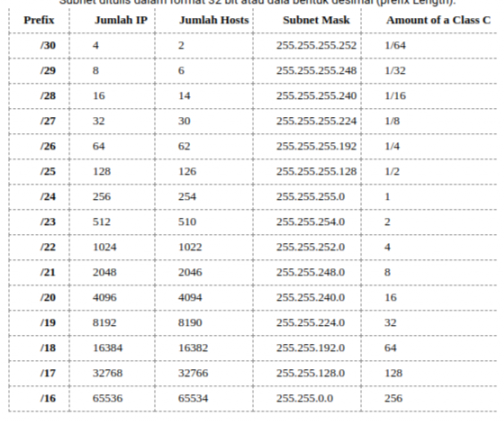

# Routing Dinamis: OSPF

Ada dua cara bagaimana algoritme *routing* dinamis bekerja, yaitu *distance-vector* (contoh: RIP, EIGRP) dan *link-state* (contoh: OSPF, IS-IS).
Perbedaan antara keduanya dapat dibaca lebih lanjut pada halaman berikut:

- Jenis protokol *routing*^[<http://www.ciscopress.com/articles/article.asp?p=2180210&seqNum=7>]
- Protokol *distance vector* dan *link state*^[<https://www.youtube.com/watch?v=ygxBBMztT4U>]

)](etc/13/dyn-routing.jpg)

## *Open Shortest Path First* (OSPF)

OSPF adalah protokol berbasis *link-state* yang paling populer.
"*Shortest path first*" mengacu pada nama algoritme yang dipakai dalam menghitung rute; sedangkan "*open*" menandakan bahwa protokol ini bersifat terbuka.
RFC2328 mendefinisikan protokol dasar (OSPFv2) dan RFC5340 menambahkan dukungan untuk IPv6 (OSPFv3).
OSPF adalah protokol handal yang baik untuk topologi yang besar dan kompleks.
Keunggulannya dibandingkan dengan RIP antara lain kemampuan mengatur beberapa jalur ke satu tujuan dan kemampuan mempartisi jaringan menjadi bagian (*area*) untuk mengurangi beban *router* dalam meng-*update* tabel *routing* ([Nemeth *et al.* 2011](https://goo.gl/RicmLf)).

## *Routing* Dinamis dengan OSPF

*Routing* dengan OSPF dapat dibagi menjadi beberapa area.
Pada contoh berikut, hanya digunakan satu area, yaitu `area 0`.

- siapkan tiga *router*: R1, R2, dan R3, hubungkan dengan kabel fiber
- siapkan jaringan lokal untuk tiap *router*: `192.168.1.0/24`, `192.168.2.0/24`, dan `192.168.3.0/24`

### Konfigurasi *router* R1

- set IP *router* R1 yang terhubung ke LAN dan set servis DHCP

    ~~~
    enable
    configure terminal
      hostname R1

      interface FastEthernet 0/0
        ip address 192.168.1.1 255.255.255.0
        no shutdown
        exit

      ip dhcp pool NET1
        network 192.168.1.0 255.255.255.0
        default-router 192.168.1.1
        exit
      ip dhcp excluded-address 192.168.1.1 192.168.1.20
    ~~~

- set IP router R1 yang terhubung dengan *router* lainnya

    ~~~
      interface FastEthernet 4/0
        ip address 192.168.0.1 255.255.255.252
        no shutdown
        exit

      interface FastEthernet 5/0
        ip address 192.168.0.5 255.255.255.252
        no shutdown
        exit
    ~~~

- konfigurasi OSPF pada tabel *routing*, tambahkan **semua jaringan dalam satu area**
    *routing* yang R1 terlibat di dalamnya, misalnya `192.168.0.0/16`

    ~~~
      router ospf 1
        network 192.168.0.0 0.0.255.255  area 0
        exit
    ~~~

- lanjutkan dengan konfigurasi R2 dan R3

### Konfigurasi *router* R2

~~~
enable
configure terminal
  hostname R2

  interface FastEthernet 0/0
    ip address 192.168.2.1 255.255.255.0
    no shutdown
    exit

  ip dhcp pool NET2
    network 192.168.2.0 255.255.255.0
    default-router 192.168.2.1
    exit
  ip dhcp excluded-address 192.168.2.1 192.168.2.20

  interface FastEthernet 5/0
    ip address 192.168.0.2 255.255.255.252
    no shutdown
    exit

  interface FastEthernet 4/0
    ip address 192.168.0.9 255.255.255.252
    no shutdown
    exit

  router ospf 1
    network 192.168.0.0 0.0.255.255  area 0
    exit

  exit
disable
~~~

### Konfigurasi *router* R3

~~~
enable
configure terminal
  hostname R3

  interface FastEthernet 0/0
    ip address 192.168.3.1 255.255.255.0
    no shutdown
    exit

  ip dhcp pool NET3
    network 192.168.3.0 255.255.255.0
    default-router 192.168.3.1
    exit
  ip dhcp excluded-address 192.168.3.1 192.168.3.20

  interface FastEthernet 4/0
    no ip address
    ip address 192.168.0.6 255.255.255.252
    no shutdown
    exit

  interface FastEthernet 5/0
    ip address 192.168.0.10 255.255.255.252
    no shutdown
    exit

  router ospf 1
    network 192.168.0.0 0.0.255.255  area 0
    exit

  exit
disable
~~~

### Pengujian

- Cek koneksi antara ketiga jaringan tersebut (mode *realtime* dan simulasi)
- Cek isi tabel *routing* tiap *router* dengan perintah `show ip route`
- Cek detail protokol dengan perintah `show ip protocols`
- Cek tetangga *router* dengan perintah `show ip ospf neighbor`

## Tugas

Tambahkan satu *router* baru R4 yang tersambung ke R2, R3, dan jaringan baru NET4 `192.168.4.0/24`.
Gunakan *routing* dinamis OSPF dan pastikan semua jaringan tersambung.

## Referensi

Lihat dokumentasi lengkapnya di halaman berikut: *configuring OSPF*^[<http://www.cisco.com/c/en/us/td/docs/ios-xml/ios/iproute_ospf/configuration/12-4t/iro-12-4t-book/iro-cfg.html>].

